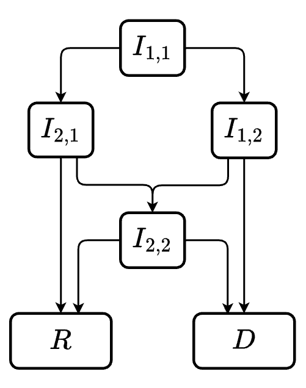

## Intro to competing risks

### Basic scenario in SIRD

In many situations, we may want to have a compartmental model where the population can transition from one state to multiple states. One classic example of this is the SIRD model.

$$
\begin{cases}
\frac{dS}{dt} = -\frac{\beta I S }{N} \\
\frac{dI}{dt} = \frac{\beta I S }{N} - (\gamma + \mu)I \\
\frac{dR}{dt} = \gamma I \\
\frac{dD}{dt} = \mu I
\end{cases}
$$

The underlying assumptions being:

-   Infectious population have a constant rate of dying/recovering (with mean infectious period being $\frac{1}{\gamma + \mu}$)

-   Amongst those exited the $I$ compartment, $\frac{\gamma}{\gamma + \mu}$ will recover while $\frac{\mu}{\gamma + \mu}%=$ will die (i.e. proportion that end up in R and D are determined by their rates).

In this formulation, we can view the infectious period as a "race" between 2 events: either transition to R or to D. In other words, these 2 transitions can also be referred to as [competing risks]{.underline}.

::: {#tip-minexp .callout-tip collapse="true"}
### Infectious period as a "race" between 2 events

Looking at the $I \rightarrow R$ and $I \rightarrow D$ transitions independently, we have:

-   The waiting time (transition time) for $I \rightarrow R$ transition is $T_{I \rightarrow R} \sim \text{Exponential}(\gamma)$

-   The waiting time (transition time) for $I \rightarrow D$ transition is $T_{I \rightarrow D} \sim \text{Exponential}(\mu)$

Thus, the infectious period (denoted $T_{I \rightarrow R, D}$) is the minimum of these 2 random variables $T_{I \rightarrow R}$ and $T_{I \rightarrow D}$. We can then formulate the CDF ([@10072][@2162184]) of $T_{I \rightarrow R, D}$ as:

$$
P(T_{I \rightarrow R, D} \leq t) = P(T_{I\rightarrow D} \leq t \text{ or } T_{I\rightarrow R} \leq t) $$ $$= 1 - P(T_{I\rightarrow D} >  t,  T_{I\rightarrow R} > t) $$ $$ = 1 - e^{-\gamma t} *e^{-\mu t} = 1- e^{-(\gamma + \mu)t}$$

We can then derive to the conclusion above, which states the infectious is exponentially distributed, with rate $\gamma + \mu$ and mean transition time $\frac{1}{\gamma + \mu}$.
:::

### Implementation

The code for SIRD model using `odin` R package is as followed

```{r message=FALSE, warning=FALSE}
library(odin)
library(tidyverse)
```

```{r message=FALSE, warning=FALSE}
#| code-fold: true
#| code-summary: "Helper function for plotting SIRD model"
plot_sird <- function(data, ylab="Proportion"){
  data %>% 
    ggplot() +
      geom_line(aes(x = t, y = S, color = "S")) +
      geom_line(aes(x = t, y = I, color = "I")) +
      geom_line(aes(x = t, y = R, color = "R")) +
      geom_line(aes(x = t, y = D, color = "D"), linetype = "dashed") + 
      scale_color_manual(
        values = c("S" = "cornflowerblue", "I" = "red", "R" = "green", "D" = "darkblue")
      )+
      labs(
        title = "Model output",
        x = "Time",
        y = ylab
      )
}
```

```{r message=FALSE, warning=FALSE, output=FALSE}
# ---- Model definition using odin ---
model_generator <- odin::odin({
  # ODE in odin syntax
  deriv(S) <- - beta * (I/N) * S
  deriv(I) <- beta * (I/N) * S - (gamma + mu)*I
  deriv(R) <- gamma*I
  deriv(D) <- mu*I

  # input parameters
  init_S <- user(0)
  init_I <- user(0)
  beta <- user(0.4)
  gamma <- user(0.2)
  mu <- user(0.05)
  
  # initialize values
  N <- init_S + init_I
  initial(S) <- init_S
  initial(I) <- init_I
  initial(R) <- 0
  initial(D) <- 0
})
```

```{r}
#| label: fig-basic-sird
#| fig-cap: "Basic SIRD"
# --- initialize simulation time ---- 
simulationDuration <- 50
times <- seq(0, simulationDuration)

# --- initialize model with init values ---- 
basic_sird <- model_generator$new(
  init_S = 1000, 
  init_I = 50)

# --- run model and plot ---- 
basic_sird <- basic_sird$run(times) %>% as.data.frame()
plot_sird(basic_sird)
```

```{r include=FALSE, eval=FALSE}
library(odin)

model_generator <- odin({
  deriv(S) <- - beta * (IR + ID)/N * S
  deriv(IR) <- r_prop*beta * (IR + ID)/N * S - gamma*IR
  deriv(ID) <- d_prop*beta * (IR + ID)/N * S - mu*ID
  deriv(R) <- gamma*IR
  deriv(D) <- mu*ID

  init_S <- user(0)
  init_I <- user(0)
  beta <- user(0.4)
  gamma <- user(0.2)
  mu <- user(0.05)
  r_prop <- user(0.5)
  d_prop <- user(0.5)
  
  
  N <- init_S + init_I
  initial(S) <- init_S
  initial(IR) <- r_prop*init_I
  initial(ID) <- d_prop*init_I
  initial(R) <- 0
  initial(D) <- 0
})


simulationDuration <- 100
times <- seq(0, simulationDuration)

odin_mod <- model_generator$new(
  init_S = 1000, init_I = 50,
  d_prop = 0.5, r_prop=0.5)
odin_mod <- odin_mod$run(times) %>% as.data.frame() %>% mutate(I = IR + ID)

plot_sird(odin_mod)
```

## Competing risks with Linear Chain Trick

### Revisit Linear Chain Trick

As previously mentioned in [another blog](https://quingzz.github.io/blog/visualize_lct/lct_viz.html), Erlang distributed infectious period can be modeled using Linear Chain Trick.

An SIR model can be generalized as:

$$
\begin{cases}
\frac{dS}{dt} = -\frac{\beta S I}{N} \\
\frac{dI_1}{dt} = \frac{\beta S I}{N} - \gamma I_1 \\
\frac{dI_2}{dt} = \gamma I_1 - \gamma I_2 \\
\vdots \\
\frac{dI_k}{dt} = \gamma I_{k - 1} - \gamma I_k \\
\frac{dR}{dt} = \gamma I_k
\end{cases}
$$

So how would the formulation after adding D compartment as a competing risk look like? To answer this, we must first consider the assumptions for $I \rightarrow D$ transitions. The 2 scenarios that will be discussed here are:

-   Time for $I \rightarrow D$ is exponentially distributed $T_{I \rightarrow D} \sim \text{Exponential}(\mu)$

-   Time for $I \rightarrow D$ is Erlang distributed $T_{I \rightarrow D} \sim \text{Erlang}(\mu, j)$

### Exponentially distributed $T_{I \rightarrow D}$

Consider the original formulation $\frac{dD}{dt} = \mu I$, after applying LCT $I$ is now the sum of $I_n$ sub-compartments i.e., $\frac{dD}{dt} = \mu\sum_{n=1}^k I_n$.

The formulation for SIRD under this assumption is thus\
$$
\begin{cases}
\frac{dS}{dt} = -\frac{\beta S I}{N} \\
\frac{dI_1}{dt} = \frac{\beta S I}{N} - \gamma I_1 - \mu I_1\\
\frac{dI_2}{dt} = \gamma I_1 - \gamma I_2 - \mu I_2 \\
\vdots \\
\frac{dI_k}{dt} = \gamma I_{k - 1} - \gamma I_k - \mu I_k \\
\frac{dR}{dt}  = \gamma I_k \\
\frac{dD}{dt} = \mu\sum_{n=1}^k I_n
\end{cases}
$$

Another way to think of the formulation is that at every compartment $I_{n}$, there is a "race" between $I_n \rightarrow I_{n+1}$ transition (or $I_n \rightarrow R$ when $n = k$) and $I_n \rightarrow D$ transition.

### Erlang distributed $T_{I \rightarrow D}$

Given a transition $I \rightarrow R$ where $T_{I \rightarrow R} \sim \text{Erlang}(\gamma, k)$, the transition time $T_{I \rightarrow R}$ can be interpreted as the time to $k_{th}$ event of a homogeneous Poisson process with rate $\gamma$ [@hurtado2019].

To model $I \rightarrow D$ and $I \rightarrow R$ as competing risks where both $T_{I \rightarrow R}$ and $T_{I \rightarrow D}$ are Erlang distributed, we can model them as a "race" between 2 Poisson processes.

Consider the simplest case where $T_{I \rightarrow R} \sim \text{Erlang}(\gamma, 2)$, $T_{I \rightarrow D} \sim \text{Erlang}(\mu, 2)$.

```{=html}
<details>
  <summary> Thought process for constructing the formula </summary>
```
***Establishing the problem***

Under the example scenario, infectious period is then a race between 2 Poisson processes:

-   $I \rightarrow R$ is a Poisson process with 2 events and rate $\gamma$

-   $I \rightarrow D$ is a Poisson process with 2 events and rate $\mu$

Denote $I \rightarrow R (i)$ as the $i_{th}$ event for $I \rightarrow R$ process (and $I \rightarrow D (i)$ for $I \rightarrow D$ respectively).

Denote $T_{I \rightarrow R (i)}$ as the interval from $(i-1)_{th}$ to $i_{th}$ event for $I \rightarrow R$ process (and $T_{I \rightarrow D (i)}$ for $I \rightarrow D$ respectively).

-   $T_{I \rightarrow R (i)} \sim \text{Exponential}(\gamma)$

-   $T_{I \rightarrow D (i)} \sim \text{Exponential}(\mu)$

***Description for the flow within*** $I$ ***compartment***

The events that can happen to an individual in $I$ can be described as followed

-   Event 1: a race between $I \rightarrow R (1)$ and $I \rightarrow D (1)$ which leads to 2 outcome.

    -   $I \rightarrow R (1)$ happens when $T_{I \rightarrow R (1)} < T_{I \rightarrow D (1)}$

    -   $I \rightarrow D (1)$ happens when $T_{I \rightarrow R (1)} > T_{I \rightarrow D (1)}$

-   Event 2: a race between $I \rightarrow R (2)$ and $I \rightarrow D (2)$, similarly lead to 2 outcome.

    -   $I \rightarrow R (2)$ happens when $T_{I \rightarrow R (2)} < T_{I \rightarrow D (2)}$

    -   $I \rightarrow D (2)$ happens when $T_{I \rightarrow R (2)} > T_{I \rightarrow D (2)}$

***The flow within*** $I$ **compartment *represented as sub-states***

The flowchart of sub-states within $I$ compartment can be represented as followed

::: columns
::: {.column width="40%"}
{width="269"}
:::

::: {.column width="60%"}
Sub-states of $I$: $I_{i,j}$ denotes the sub-population awaiting for: $i_{th}$ event of $I \rightarrow R$ (i.e. $I \rightarrow R (i)$) [OR]{.underline} $j_{th}$ event of $I \rightarrow R$ (i.e. $I \rightarrow D (j)$)

Description of the flowchart:

-   All incoming population for compartment $I$ flows into $I_{1,1}$ and awaiting for: $I \rightarrow R(1)$ or $I \rightarrow D(1)$.

-   $I_{1,2}$ and $I_{2,1}$ represent the 2 outcomes of event 1, where:

    -   $I_{2,1}$ are individuals from $I_{1,1}$ that experienced $I \rightarrow R(1)$ and awaiting: $I \rightarrow R(2)$ or $I \rightarrow D(1)$

    -   $I_{1,D}$ are individuals from $I_{1,1}$ that experienced $I \rightarrow D(1)$ and awaiting: $I \rightarrow D(2)$ or $I \rightarrow R(1)$

-   $I_{2,2}$ is another latent space where:

    -   The incoming individuals are: $I_{2,1}$ that experienced $I \rightarrow D(1)$ [AND]{.underline} $I_{1,2}$ that experienced $I \rightarrow R(1)$.

    -   And awaiting: $I \rightarrow D(2)$ or $I \rightarrow R(2)$

-   Since $I \rightarrow D(2)$ and $I \rightarrow R(2)$ are the end point of the 2 Poisson processes, which are equivalent to transitioning to $R$ and $D$ respectively.
:::
:::

Intuitive understanding for $I_{1,2}$, $I_{2,1}$ and $I_{2,2}$:

-   $I_{2,1}$ can be understood as individuals set out to complete $I \rightarrow R$ process. Under the case that $I \rightarrow D(1)$ happen before $I \rightarrow R(2)$, individuals in $I_{2,1}$ must wait for another time period. This extra time period is what $I_{2,2}$ are for.

-   Similar reasoning can be applied for $I_{1,2}$

***Constructing the mean field ODE system***

With the flowchart presented, the remaining process is relatively straightforward when we consider what we have established so far:

-   $T_{I \rightarrow R (i)} \sim \text{Exponential}(\gamma)$

-   $T_{I \rightarrow D (i)} \sim \text{Exponential}(\mu)$

-   $\text{min}(T_{I \rightarrow R (i)}, T_{I \rightarrow D (i)}) \sim \text{Exponential}(\gamma + \mu)$ (refer to @tip-minexp).

</details>

The mean field ODE for this scenario is as followed

$$
\begin{cases}
\frac{dS}{dt} = -\frac{\beta I S}{N} \\
\frac{dI_{1,1}}{dt} = \frac{\beta I S}{N} - (\gamma + \mu)I_{1,1} \\
\frac{dI_{2,1}}{dt} = \gamma I_{1,1} - (\gamma + \mu)I_{2,1} \\
\frac{dI_{1,2}}{dt} = \mu I_{1,1} - (\gamma + \mu)I_{1,2} \\
\frac{dI_{2,2}}{dt} =  \mu I_{2,1} + \gamma I_{1,2} - (\gamma + \mu)I_{2,2} \\
\frac{dR}{dt} = \gamma I_{2,1} + \gamma I_{2,2} \\
\frac{dD}{dt} = \mu I_{1,2} + \mu I_{2,2}
\end{cases}
$$

Formulations $\frac{dI_{i,j}}{dt}$, $\frac{dR}{dt}$, $\frac{dD}{dt}$ can be generalized as followed

$$
dI_{i,j} = \gamma I_{i-1, j} + \mu I_{i, j-1} - (\gamma + \mu) I_{i,j}
$$

$$
\frac{dR}{dt} = \gamma \sum_{a=1}^m I_{n-1, a}
$$

$$
\frac{dD}{dt} = \mu\sum_{b=1}^n I_{b, m-1}
$$

Where:

-   $m$ is the shape parameter for distribution of $T_{I\rightarrow D}$

-   $n$ is the shape parameter for distribution of $T_{I\rightarrow R}$

<!-- -->

-   $I_{i, j} = 0$ when $i = 0$ or $j = 0$

-   $i<=n$ and $j \leq m$

### Implementation

Model set up for this example is as followed

-   $T_{I \rightarrow R} \sim \text{Erlang}(\text{rate}= \gamma, \text{shape} = 3)$

-   $T_{I \rightarrow D} \sim \text{Erlang}(\text{rate}= \mu, \text{shape} = 2)$

Implementation in R using `odin` package

```{r message=FALSE, warning=FALSE, output=FALSE}
sird_lct <- odin({
  # ODE in odin syntax
  deriv(S) <- - beta * ((I11 + I12 + I21 + I22 + I31 + I32)/N) * S
  # all incoming population from S go to I11
  deriv(I11) <- beta * ((I11 + I12 + I21 + I22 + I31 + I32)/N) * S - (gamma + mu)*I11
  # sub-compartments for I
  deriv(I12) <- mu*I11 - (gamma + mu)*I12
  deriv(I21) <- gamma*I11 - (gamma + mu)*I21
  deriv(I22) <- gamma*I12 + mu*I21 - (gamma + mu)*I22
  deriv(I31) <- gamma*I21 - (gamma + mu)*I31
  deriv(I32) <- mu*I31 + gamma*I22 - (gamma + mu)*I32
  # handle R and D compartments
  deriv(R) <- gamma*I31 + gamma*I32
  deriv(D) <- mu*I12 + mu*I22 + mu*I32

  # input parameters
  init_S <- user(0)
  init_I <- user(0)
  beta <- user(0.4)
  gamma <- user(0.2)
  mu <- user(0.1)
  
  # initialize values
  N <- init_S + init_I
  initial(S) <- init_S
  initial(I11) <- init_I
  initial(I12) <- 0
  initial(I21) <- 0
  initial(I22) <- 0
  initial(I31) <- 0
  initial(I32) <- 0
  initial(R) <- 0
  initial(D) <- 0
})
```

```{r}
#| label: fig-lct-sird
#| fig-cap: "SIRD with LCT"
# --- initialize simulation time ---- 
simulationDuration <- 50
times <- seq(0, simulationDuration)

# --- initialize model with init values ---- 
odin_mod <- sird_lct$new(
  init_S = 999, 
  init_I = 1)

# --- run model and plot ---- 
odin_mod <- odin_mod$run(times) %>% 
  as.data.frame() %>% 
  mutate(
    I = I11 + I12 + I21 + I22 + I32 + I31
  )
plot_sird(odin_mod, ylab="Count")
```

## Generalized transition time distribution

There have been several approaches proposed to handle arbitrary dwell time distributions in compartmental model, using delay-integro differential equations [@hernández2021] or delay differential equation (DDE) [@hong2024].

This blog, however, aim to re-frame the problem under the context of survival analysis to handle compartmental model with independent, arbitrarily distributed competing risks. This approach has been explored in a previous work by @tallis1994.

### Competing risks in terms of hazard functions

Some annotations and indications within the context of compartmental model:

-   $f(t)$ is the probability density function (PDF) - indicate the instantaneous probability that an individual leave the compartment at time $t$.

-   $S(t)$ is the survival function - indicate the probability that an individual still stay in the compartment at time $t$. It is worth pointing out that $f(t) = -\frac{d}{dt}S(t)$.

-   $h(t)$ is the function for hazard rate - indicate the instantaneous rate of leaving a compartment, given that individuals have stayed in the compartment till time $t$. (i.e., $h(t) = \frac{f(t)}{S(t)}$)

-   The subscript of function annotation denotes which event this function is for. For example, $f_{I \rightarrow R}(t)$ refers to the PDF for the $I \rightarrow R$ transition.

::: {.callout-tip collapse="true"}
#### Example: SIR model in terms of hazard function

An SIR model with arbitrary distributed infectious period could be rewritten in terms of hazard function as followed

$$
\begin{cases}
dS(t) = -\beta\frac{I(t)}{N}S(t) \\
dI(t) = \beta\frac{I(t)}{N}S(t) - \int_0^\mathcal{T} h_{I\rightarrow R}(\tau) I(t, \tau) d\tau \\
dR(t) = \int_0^\mathcal{T} h_{I\rightarrow R}(\tau) I(t) d\tau
\end{cases}
$$

Where:

-   $\mathcal{T}$ denotes the maximal dwell time in $I$

```{=html}
<!-- -->
```
-   $I(t, \tau)$ denotes the sub-population of $I$ at time $t$ that have stayed for $\tau$ time period.
:::

Consider a scenario where compartment $X$ can transition to $n$ out compartments denoted $O_i$ where $i \in \{1,2,...,n\}$. We model these out transition as $n$ competing risks (assumed to be independent) with arbitrary parametric distribution.

The survival function for leaving $X$ (denoted $S_X (t)$) is the product of survival functions for all $X \rightarrow O_i$.

$$
S_X(t) = \prod_{i = 1}^{n} S_{X \rightarrow O_i}(t)
$$

::: {.callout-note collapse="true"}
#### Formulation for $S_X(t)$

Recall that $S_X(1)$ is equivalent to $P(T_X > t)$ (i.e. probability that individual have not left $X$ compartment at time $t$).

$$
P(T_X > t) = P(T_{X\rightarrow O_1} > t, T_{X\rightarrow O_2} > t, ..., T_{X\rightarrow O_n} > t)
$$

Under the assumption that these competing risks are independent

$$
P(T_X > t) = P(T_{X\rightarrow O_1} > t) * P(T_{X\rightarrow O_2} > t) * ...*P( T_{X\rightarrow O_n} > t)
$$

$$
P(T_X > t) = \prod_{i=1}^n P(T_{X \rightarrow O_i} >t)
$$
:::

The hazard function for leaving $X$ can then be represented as.

$$
h_X(t) = \frac{f_X(t)}{S_X(t)} = \frac{-\frac{d}{dt} S_X(t)}{S_X(t)} = \frac{-\frac{d}{dt} \prod_{i = 1}^{n} S_{X \rightarrow O_i}(t)}{\prod_{i = 1}^{n} S_{X \rightarrow O_i}(t)}
$$

After a few steps of simplifying the function, we will eventually arrive at the following.

$$
h_X(t) = \sum_{i = 1}^n\frac{ f_{X \rightarrow O_i}(t)}{S_{X \rightarrow O_i}(t)} = \sum_{i = 1}^n h_{X \rightarrow O_i}(t)
$$

::: {.callout-note collapse="true"}
#### Simplifying $h_X(t)$

$$
h_X(t) = \frac{-\frac{d}{dt} \prod_{i = 1}^{n} S_{X \rightarrow O_i}(t)}{\prod_{i = 1}^{n} S_{X \rightarrow O_i}(t)}
$$

By applying the product rule for differentiation, we have

$$
h_X(t) = \frac{-\sum_{i = 1}^n \frac{d}{dt} S_{X \rightarrow O_i}(t) * \prod^{n, n \neq i}_{j=1} S_{X \rightarrow O_j}(t) }{\prod_{i = 1}^{n} S_{X \rightarrow O_i}(t)}
$$

Where $\prod^{n, n \neq i}_{j=1} S_{X \rightarrow O_j}(t)$ denotes product of $S_{X \rightarrow O_j}(t)$ where $j$ ranges from $1$ to $n$ [and]{.underline} $j \neq i$. (i.e., $j \in \{1,2,3, ..., n\} \setminus \{i\}$)

Recall that $f(t) = -\frac{d}{dt}S(t)$

We can then rewrite $h_{X}(t)$ as followed

$$
h_X(t) = -\sum_{i = 1}^n\frac{ -f_{X \rightarrow O_i}(t) * \prod^{n, n \neq i}_{j=1} S_{X \rightarrow O_j}(t) }{\prod_{k = 1}^{n} S_{X \rightarrow O_k}(t)}
$$

Since $\frac{\prod^{n, n \neq i}_{j=1} S_{X \rightarrow O_j}(t) }{\prod_{k = 1}^{n} S_{X \rightarrow O_k}(t)} = \frac{\prod^{n, n \neq i}_{j=1} S_{X \rightarrow O_j}(t)}{S_{X \rightarrow O_i}(t)*\prod^{n, n \neq i}_{k=1} S_{X \rightarrow O_k}(t)} = \frac{1}{S_{X \rightarrow O_i}(t)}$

We can further simplify $h_X(t)$ as

$$
h_X(t) = 
-\sum_{i = 1}^n\frac{ -f_{X \rightarrow O_i}(t)}{S_{X \rightarrow O_i}(t)} = 
\sum_{i = 1}^n\frac{f_{X \rightarrow O_i}(t)}{S_{X \rightarrow O_i}(t)} =
\sum_{i=1}^n h_{X \rightarrow O_i}(t)
$$
:::

#### Okay? so what does all this mean?

The takeaway point here is that the hazard rate of leaving $X$ compartment can be rewritten in terms of the hazard rates of each competing risk $X \rightarrow O_i$.

That is to say, we can simulate the dynamics of $X$ compartment numerically if we:

-   Know the PDF (or CDF) of each competing $X \rightarrow O_i$ transition.

-   [OR]{.underline}, a good estimation for the probability distribution of time for $X \rightarrow O_i$ transition, from which an estimation for cumulative probability can be computed (thus hazard rate can be inferred).

Where the system of derivatives to describe the dynamics of $X$ and $O_i$ is as followed

$$
\begin{cases}
\frac{dX(t)}{dt} = - \int_{0}^{\mathcal{T}} h_X(\tau)*X(t, \tau) d\tau = - \int_{0}^{\mathcal{T}} \sum_{i=1}^{n} h_{X \rightarrow O_i}(\tau)*X(t, \tau) d\tau \\
\frac{dO_1(t)}{dt} = \int_{0}^{\mathcal{T}} h_{X\rightarrow O_1}(\tau)*X(t,\tau)d\tau \\
\vdots \\
\frac{dO_n(t)}{dt} = \int_{0}^{\mathcal{T}} h_{X\rightarrow O_n}(\tau)*X(t,\tau)d\tau \\
\end{cases}
$$ {#eq-comp-hazard}

Where:

-   $\mathcal{T}$ denotes the maximal dwell time in $X$

```{=html}
<!-- -->
```
-   $\tau$ denotes the time-since-entering the $X$ compartment.

-   $X(t, \tau)$ denotes the sub-population of $X$ at time $t$ that have stayed for $\tau$ time period.

### Recover previous formulations under the new problem framing

::: {.callout-note collapse="true"}
#### Classic SIRD

Under the assumption that $T_{I \rightarrow R} \sim \text{Exponential}(\gamma)$ and $T_{I \rightarrow D} \sim \text{Exponential}(\mu)$

The hazard function for leaving the $I$ compartment is

$$
h_{I \rightarrow R,D}(t) = \frac{ f_{I \rightarrow R}(t)}{S_{I \rightarrow R}(t)} + \frac{ f_{I \rightarrow D}(t)}{S_{I \rightarrow D}(t)} = 
\frac{\gamma e^{-\gamma t}}{e^{-\gamma t}} + 
\frac{\mu e^{-\mu t}}{e^{-\mu t}} = \gamma + \mu
$$

We put emphasis on the derivative for $I$ for now

$$
\frac{dI(t)}{dt} = - \int_0^\mathcal{T} (\gamma + \mu) I(t,\tau)d \tau = - (\gamma + \mu) \int_0^\mathcal{T} I(t,\tau)d \tau 
$$\
Recall that $\int_0^\tau I(t,\tau)d \tau$ is basically "summing up" all the sub-populations of $I$ at time $t$, thus the result of the integral is simply $I(t)$. Thus:

$$
\frac{dI(t)}{dt} = (\gamma + \mu) I(t)
$$

Following similar steps, you can also recover formulas for $\frac{dR}{dt}$ and $\frac{dD}{dt}$

Another way to look at this since the hazard function $h_{I \rightarrow R,D}(t)$ is simply a constant (in this scenario), we can conclude: the rate of leaving $I$ does not depend on how long an individual have stayed in $I$.
:::


### Implementation

SIRD model set up:

-   $S \rightarrow I$ follows traditional SIRD definition
-   $T_{I\rightarrow R} \sim \text{Erlang}(\text{rate = }\gamma, \text{shape = }3)$
-   $T_{I\rightarrow D} \sim \text{Erlang}(\text{rate = }\mu, \text{shape = }2)$

Implementation details:

-   The implemented model is in [discrete time]{.underline}, where lower timestep results in better estimation (since we're doing numerical simulation).

-   For modeling simplicity, the implementation here is deterministic.

There are 2 main steps for the implementation:

-   Implement function to compute time varying hazard rates (i.e. estimation for `h(t)`) given PDF for $T_{I \rightarrow R}$ and $T_{I \rightarrow D}$.

-   Implement the discrete SIRD model given hazard rates for $T_{I \rightarrow R}$ and $T_{I \rightarrow D}$.

#### Function to generate hazard rates

To implement this function, we first need to decide what should be the limit for $\tau$ (i.e. the limit for $T_{I \rightarrow R}$ and $T_{I \rightarrow D}$).

The most straight forward way is to find $\tau$ where $S_{I}(\tau) = 0$. However, since $S_I(t)$ is asymptotic to 0, the best we can do is choose $\tau$ where $S_I(\tau)$ is sufficiently close to 0 (or in other words, when cumulative distribution is sufficiently close to 1).

An implementation in R is provided below.

```{r  message=FALSE, warning=FALSE}
#| code-fold: true
#| code-summary: "Function to compute hazard rates"

#' Compute hazard rate over dwell time
#'
#' @param dist_func - R distribution function for dwell time (pexp, pgamma, etc.)
#' @param ... - parameters for dist_func
#' @param timestep - timestep used for the discrete model
#' @param error_tolerance - how close to 1 the cumulative probability must be
#'
#' @return probability distribution, cumulative prob distribution and hazard rates
compute_hazard <- function(dist_func,..., timestep=0.05, error_tolerance=0.0001){
  maxtime <- timestep
  prev_prob <- 0
  hazard_rates <- numeric()
  cumulative_dist <- numeric()
  prob_dist <- numeric()
  
  while(TRUE){
     # get current cumulative prob and check whether it is sufficiently close to 1
     temp_prob <-  if_else(
       dist_func(maxtime, ...) < (1 - error_tolerance), 
       dist_func(maxtime, ...), 
       1);
     cumulative_dist <- c(cumulative_dist, temp_prob)
     
     # get f(t)
     curr_prob <- temp_prob - prev_prob
     prob_dist <- c(prob_dist, curr_prob)
     
     # compute h(t) = f(t)/S(t)
     curr_hazard <- curr_prob/(1-prev_prob)
     hazard_rates <- c(hazard_rates, curr_hazard)
     
     prev_prob <- temp_prob
     maxtime <- maxtime + timestep
     
     if(temp_prob == 1){
       break
     }
  }
  
  data.frame(
    prob_dist = prob_dist,
    cumulative_dist = cumulative_dist,
    hazard_rates = hazard_rates
  )
}
```

#### SIRD model implemeted in odin

To implement this function, we first need to address 2 problems:

-   How should $I$ be partitioned? (i.e. what each sub-compartment in $I$ represents)

-   What should be the number of $I$ sub-compartments?

Recall @eq-comp-hazard, we need to keep track of $I(t, \tau)$ which is the sub-population of $I(t)$ that have stayed for $\tau$ time period. In discrete time, it is equivalent to dividing $I(t)$ into $\frac{\max(\tau)}{timestep}$ sub-compartments.

Since we are dealing with 2 out compartments ($R$ and $D$), the maximum dwell time in $I$ is the greater of $\text{max}(T_{I \rightarrow R})$ and $\text{max}(T_{I \rightarrow D})$.

An implementation in R using `odin2` package is provided below.

```{r  message=FALSE, warning=FALSE, output=FALSE}
#| code-fold: true
#| code-summary: "SIRD model with hazard rates"

# ---- Install packages -----
# install.packages(
#   "odin2",
#   repos = c("https://mrc-ide.r-universe.dev", "https://cloud.r-project.org"))
# install.packages(
#   "dust2",
#   repos = c("https://mrc-ide.r-universe.dev", "https://cloud.r-project.org"))
sird_mod <- odin2::odin(
  {
    # ----- Define algo to update compartments here ---------
    # classic definition of S->I transition 
    update(S) <- S - dt * S * beta * sum(I) / N

    update(I[1]) <- dt * S * beta* sum(I)/N
    # transprob is basically h(tau)
    # starting from 2: to simulate individuals staying in I for another timestep
    update(I[2:r_maxtime]) <- I[i-1]*(1-transprob[i-1])
    
    dim(I_to_R) <- r_maxtime
    I_to_R[1:r_maxtime] <- r_hazard[i]*I[i]
    sum_I_to_R <- sum(I_to_R)
    update(R) <- R + sum_I_to_R
    
    dim(I_to_D) <- d_maxtime
    I_to_D[1:d_maxtime] <- d_hazard[i]*I[i]
    sum_I_to_D <- sum(I_to_D)
    update(D) <- D + sum_I_to_D
    
    # print("I to R {sum_I_to_R} I to D {sum_I_to_D}")
    
    # initial population
    initial(S) <- S_init
    initial(I[]) <- I_init[i]
    maxtime <- max(r_maxtime, d_maxtime)
    dim(I) <- maxtime
    initial(R) <- R_init
    initial(D) <- D_init
    
    # ----- Inputs -------
    beta <- parameter()
    
    # dwell time distribution of r 
    r_hazard<- parameter()
    r_maxtime <- parameter()
    dim(r_hazard) <- r_maxtime
    
    # dwell time distribution of d
    d_hazard <- parameter()
    d_maxtime <- parameter()
    dim(d_hazard) <- d_maxtime
    
    # initial populations
    S_init <- parameter()
    I_init <- parameter()
    dim(I_init) <- maxtime
    R_init <- parameter()
    D_init <- parameter()
    N <- parameter(1000)
    
    # ----- Compute out transition (i.e. hazard rate) here --------
    # computing overall h(tau) for I
    dim(transprob) <- maxtime
    mintime <- min(r_maxtime, d_maxtime)
    transprob[1:mintime] <- r_hazard[i] + d_hazard[i]
    # handle scenarios where maximum dwell time in R>D or maximum dwell time in D<R
    transprob[(mintime+1):maxtime] <- if(i>r_maxtime) d_hazard[i] else r_hazard[i]
  }
)
```

#### Run the model

We will run the model under the following configurations

```{r  message=FALSE, warning=FALSE}
#| code-fold: true
#| code-summary: "Model config"

# ----- modeling configurations -----
mod_config <- list(
  r_dist = pgamma,
  r_params = list(rate=0.2, shape=3),
  d_dist = pgamma,
  d_params = list(rate=0.1, shape=2),
  beta = 0.4,
  S = 999,
  I = 1,
  R = 0,
  D = 0
)
timestep <-  0.05
simulation_duration <- 50
```

```{r  message=FALSE, warning=FALSE}
#| code-fold: true
#| code-summary: "Run model"

# ---- Compute hazard rates ----- 
r_hazard <- compute_hazard(mod_config$r_dist, 
                           rate=mod_config$r_params$rate, 
                           shape=mod_config$r_params$shape)$hazard_rates
d_hazard <- compute_hazard(mod_config$d_dist, 
                           rate=mod_config$d_params$rate, 
                           shape=mod_config$d_params$shape)$hazard_rates

# ---- Run model and plot ----- 
# initialize params
odin_pars <- list(
  beta =  mod_config$beta,
  N =  mod_config$N,
  r_hazard = r_hazard,
  r_maxtime = length(r_hazard),
  d_hazard = d_hazard,
  d_maxtime = length(d_hazard),
  S_init = mod_config$S,
  I_init = array( c(mod_config$I, rep(0, max(length(r_hazard), length(d_hazard))-1)) ),
  R_init = mod_config$R,
  D_init = mod_config$D
)

# run model
t_seq <- seq(0, simulation_duration, 0.25)
sird <- dust2::dust_system_create(sird_mod, odin_pars, dt = timestep)
dust2::dust_system_set_state_initial(sird)
out <- dust2::dust_system_simulate(sird, t_seq)
out <- dust2::dust_unpack_state(sird, out)

h_result <- data.frame(
  t = t_seq,
  S = out$S,
  I = colSums(out$I),
  R = out$R,
  D = out$D
)
# plot output 
plot_sird(h_result, ylab="Count")
```

We can cross check the result with the output using LCT @fig-lct-sird

### Related packages

`denim` R package implements this approach to handle arbitrary dwell time distribution, and provide a generalized API for scalable models.

Refers to the documentation [here](https://drthinhong.com/denim/).

```{r}
#| code-fold: true
#| code-summary: "Configure and run model in denim"
library(denim)
# --- model definition in denim --- 
sird_denim <- list(
  "S -> I" = "beta * S * I/N * timeStep",
  "I -> R" = d_gamma(rate = 0.2, shape = 3),
  "I -> D" = d_gamma(rate = 0.1, shape = 2)
)

# --- set up parameters and initial values -----
denim_pars <- list(
  beta = 0.4,
  N = 1000
)
denim_initial_vars <- list(
  S = 999,
  I = 1,
  R = 0,
  D = 0
)

# --- run model ------
denim_out <- sim(sird_denim,
    denim_initial_vars,
    denim_pars,
    simulationDuration = 50,
    timeStep = 0.05)
```

```{r}
#| code-fold: true
#| code-summary: "Plot SIRD implemented in denim"
denim_out %>%
  rename(t = Time) %>% 
  plot_sird(ylab="Count")
```

Once again, we compare this with the output using LCT @fig-lct-sird

## Takeaway points

Basic implementation of SIRD:

-   Infectious period can be interpreted as a race between $I \rightarrow R$ and $I \rightarrow D$

-   The implicit assumptions are: $T_{I \rightarrow R} \sim \text{Exponential}(\text{rate} = \gamma)$ and $T_{I \rightarrow D} \sim \text{Exponential}(\text{rate} = \mu)$

SIRD with linear chain trick:

-   Used for implementing Erlang distributed $T_{I \rightarrow R}$ and/or $T_{I \rightarrow D}$ using a system of ODE.
-   It is useful to frame the problem as a race between homogeneous Poisson processes.

Arbitrary distributed $T_{I \rightarrow R}$ and $T_{I \rightarrow D}$:

-   It is suggested that framing the problem in term of time varying hazard rates, then solving it numerically may prove to be useful.

-   The underlying assumption is that the distributions for $T_{I \rightarrow R}$ and $T_{I \rightarrow D}$ are independent.

## References {.unnumbered}
