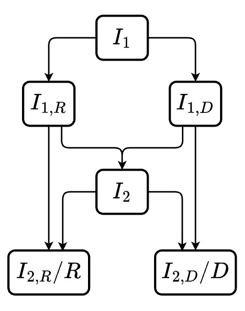

## Competing risks in SIRD

In many situations, we may want to have a compartmental model where the population can transition from one state to multiple states. One classic example of this is the SIRD model.

$$
\begin{cases}
\frac{dS}{dt} = -\frac{\beta I S }{N} \\
\frac{dI}{dt} = \frac{\beta I S }{N} - (\gamma + \mu)I \\
\frac{dR}{dt} = \gamma I \\
\frac{dD}{dt} = \mu I
\end{cases}
$$

The underlying assumptions being:

-   Infected have a constant rate of dying/recovering (with infectious period being $\frac{1}{\gamma + \mu}$)

-   Amongst those exited the $I$ compartment, $\frac{\gamma}{\gamma + \mu}$ will recover while $\frac{\mu}{\gamma + \mu}%=$ will die (i.e. proportion that end up in R and D are determined by their rates).

In this formulation, we can view the infectious period as a "race" between 2 events: either transition to R or to D. In other words, these 2 transitions can also be referred to as [competing risks]{.underline}.

::: {#tip-minexp .callout-tip collapse="true"}
### Infectious period as a "race" between 2 events

Looking at the $I \rightarrow R$ and $I \rightarrow D$ transitions independently, we have:

-   The waiting time (transition time) for $I \rightarrow R$ transition is $T_{I \rightarrow R} \sim \text{Exponential}(\gamma)$

-   The waiting time (transition time) for $I \rightarrow D$ transition is $T_{I \rightarrow D} \sim \text{Exponential}(\mu)$

Thus, the infectious period (denoted $T_{I \rightarrow R, D}$) is the minimum of these 2 random variables $T_{I \rightarrow R}$ and $T_{I \rightarrow D}$. We can then formulate the CDF ([@10072][@2162184]) of $T_{I \rightarrow R, D}$ as:

$$
P(T_{I \rightarrow R, D} \leq t) = P(T_{I\rightarrow D} \leq t \text{ or } T_{I\rightarrow R} \leq t) $$ $$= 1 - P(T_{I\rightarrow D} >  t,  T_{I\rightarrow R} > t) $$ $$ = 1 - e^{-\gamma t} *e^{-\mu t} = 1- e^{-(\gamma + \mu)t}$$

We can then derive to the conclusion above, which states the infectious is exponentially distributed, with rate $\gamma + \mu$ and mean transition time $\frac{1}{\gamma + \mu}$.
:::

## Implementation

The following example implements SIRD model using odin R package

```{r message=FALSE, warning=FALSE}
library(odin)
library(tidyverse)
```

```{r message=FALSE, warning=FALSE}
#| code-fold: true
#| code-summary: "Helper function for plotting SIRD model"
plot_sird <- function(data){
  data %>% 
    ggplot() +
      geom_line(aes(x = t, y = S, color = "S")) +
      geom_line(aes(x = t, y = I, color = "I")) +
      geom_line(aes(x = t, y = R, color = "R")) +
      geom_line(aes(x = t, y = D, color = "D"), linetype = "dashed") + 
      scale_color_manual(
        values = c("S" = "cornflowerblue", "I" = "red", "R" = "green", "D" = "darkblue")
      )+
      labs(
        title = "Model output",
        x = "Time",
        y = "Proportion"
      )
}
```

```{r message=FALSE, warning=FALSE}
model_generator <- odin({
  # ODE in odin syntax
  deriv(S) <- - beta * (I/N) * S
  deriv(I) <- beta * (I/N) * S - (gamma + mu)*I
  deriv(R) <- gamma*I
  deriv(D) <- mu*I

  # input parameters
  init_S <- user(0)
  init_I <- user(0)
  beta <- user(0.4)
  gamma <- user(0.2)
  mu <- user(0.05)
  
  # initialize values
  N <- init_S + init_I
  initial(S) <- init_S
  initial(I) <- init_I
  initial(R) <- 0
  initial(D) <- 0
})

# --- initialize simulation time ---- 
simulationDuration <- 50
times <- seq(0, simulationDuration)

# --- initialize model with init values ---- 
odin_mod <- model_generator$new(
  init_S = 1000, 
  init_I = 50)

# --- run model and plot ---- 
odin_mod <- odin_mod$run(times) %>% as.data.frame()
plot_sird(odin_mod)
```

```{r include=FALSE}
library(odin)

model_generator <- odin({
  deriv(S) <- - beta * (IR + ID)/N * S
  deriv(IR) <- r_prop*beta * (IR + ID)/N * S - gamma*IR
  deriv(ID) <- d_prop*beta * (IR + ID)/N * S - mu*ID
  deriv(R) <- gamma*IR
  deriv(D) <- mu*ID

  init_S <- user(0)
  init_I <- user(0)
  beta <- user(0.4)
  gamma <- user(0.2)
  mu <- user(0.05)
  r_prop <- user(0.5)
  d_prop <- user(0.5)
  
  
  N <- init_S + init_I
  initial(S) <- init_S
  initial(IR) <- r_prop*init_I
  initial(ID) <- d_prop*init_I
  initial(R) <- 0
  initial(D) <- 0
})


simulationDuration <- 100
times <- seq(0, simulationDuration)

odin_mod <- model_generator$new(
  init_S = 1000, init_I = 50,
  d_prop = 0.5, r_prop=0.5)
odin_mod <- odin_mod$run(times) %>% as.data.frame() %>% mutate(I = IR + ID)

plot_sird(odin_mod)
```

## Competing risks with other transition time distributions

### Erlang via Linear Chain Trick

As previously mentioned in [another blog](https://quingzz.github.io/blog/visualize_lct/lct_viz.html), Erlang distributed infectious period can be modeled using Linear Chain Trick.

An SIR model can be generalized as:

$$
\begin{cases}
\frac{dS}{dt} = -\frac{\beta S I}{N} \\
\frac{dI_1}{dt} = \frac{\beta S I}{N} - \gamma I_1 \\
\frac{dI_2}{dt} = \gamma I_1 - \gamma I_2 \\
\vdots \\
\frac{dI_k}{dt} = \gamma I_{k - 1} - \gamma I_k \\
\frac{dR}{dt} = \gamma I_k
\end{cases}
$$

So how would the formulation after adding another D compartment as a competing risk look like? To answer this, we must consider the assumptions for $I \rightarrow D$ transitions. The 2 scenarios that will be discussed here are:

-   Time for $I \rightarrow D$ is exponentially distributed $T_{I \rightarrow D} \sim \text{Exponential}(\mu)$

-   Time for $I \rightarrow D$ is Gamma distributed $T_{I \rightarrow D} \sim \text{Erlang}(\mu, j)$

#### Exponentially distributed $T_{I \rightarrow D}$

Consider the original formulation $\frac{dD}{dt} = \mu I$, after applying LCT $I$ is now the sum of $I_n$ sub-compartments i.e., $\frac{dD}{dt} = \mu\sum_{n=1}^k I_n$.

The formulation for SIRD under this assumption is thus\
$$
\begin{cases}
\frac{dS}{dt} = -\frac{\beta S I}{N} \\
\frac{dI_1}{dt} = \frac{\beta S I}{N} - \gamma I_1 - \mu I_1\\
\frac{dI_2}{dt} = \gamma I_1 - \gamma I_2 - \mu I_2 \\
\vdots \\
\frac{dI_k}{dt} = \gamma I_{k - 1} - \gamma I_k - \mu I_k \\
\frac{dR}{dt}  = \gamma I_k \\
\frac{dD}{dt} = \mu\sum_{n=1}^k I_n
\end{cases}
$$

Another way to look at the formulation is that at every compartment $I_{n}$, there is a "race" between $I_n \rightarrow I_{n+1}$ transition (or $I_n \rightarrow R$ when $n = k$) and $I_n \rightarrow D$ transition.

#### Erlang distributed $T_{I \rightarrow D}$

Given transition $I \rightarrow R$ where $T_{I \rightarrow R} \sim \text{Erlang}(\gamma, k)$, $T_{I \rightarrow R}$ can be thought of as the time to $k_{th}$ event of a homogenous Poisson process with rate $\gamma$ [@hurtado2019].

To model $I \rightarrow D$ and $I \rightarrow R$ as competing risks where both $T_{I \rightarrow R}$ and $T_{I \rightarrow D}$ are Erlang distributed, we can model them as a "race" between 2 Poisson processes.

Consider the simplest case where $T_{I \rightarrow R} \sim \text{Erlang}(\gamma, 2)$, $T_{I \rightarrow D} \sim \text{Erlang}(\mu, 2)$, the SIRD model now look as followed.

```{=html}
<details>
  <summary> Thought process behind the formula </summary>
```
***Establishing the problem***

Under the example scenario, infectious period is then a race between 2 Poisson processes:

-   $I \rightarrow R$ is a Poisson process with 2 events and rate $\gamma$

-   $I \rightarrow D$ is a Poisson process with 2 events and rate $\mu$

Denote $I \rightarrow R (i)$ as the $i_{th}$ event for $I \rightarrow R$ process (and $I \rightarrow D (i)$ for $I \rightarrow D$ respectively).

Denote $T_{I \rightarrow R (i)}$ as the interval from $(i-1)_{th}$ to $i_{th}$ event for $I \rightarrow R$ process (and $T_{I \rightarrow D (i)}$ for $I \rightarrow D$ respectively).

-   $T_{I \rightarrow R (i)} \sim \text{Exponential}(\gamma)$

-   $T_{I \rightarrow D (i)} \sim \text{Exponential}(\mu)$

***Description for the flow within*** $I$ ***compartment***

The events that can happen to an individual in $I$ can be described as followed

-   Event 1: a race between $I \rightarrow R (1)$ and $I \rightarrow D (1)$ which leads to 2 outcome.

    -   $I \rightarrow R (1)$ happens when $T_{I \rightarrow R (1)} < T_{I \rightarrow D (1)}$

    -   $I \rightarrow D (1)$ happens when $T_{I \rightarrow R (1)} > T_{I \rightarrow D (1)}$

-   Event 2: a race between $I \rightarrow R (2)$ and $I \rightarrow D (2)$, similarly lead to 2 outcome.

    -   $I \rightarrow R (2)$ happens when $T_{I \rightarrow R (2)} < T_{I \rightarrow D (2)}$

    -   $I \rightarrow D (2)$ happens when $T_{I \rightarrow R (2)} > T_{I \rightarrow D (2)}$

***The flow within*** $I$ **compartment *represented as sub-states***

The flowchart of sub-states within $I$ compartment can be represented as followed

::: columns
::: {.column width="40%"}
{width="269"}
:::

::: {.column width="60%"}
Description of the flowchart:

-   All incoming population for compartment $I$ flows into $I_1$ and awaiting for: $I \rightarrow R(1)$ or $I \rightarrow D(1)$.

-   $I_{1,R}$ and $I_{1,D}$ represent the 2 outcomes of event 1, where:

    -   $I_{1,R}$ are individuals from $I_1$ that went through $I \rightarrow R(1)$ and awaiting: $I \rightarrow R(2)$ or $I \rightarrow D(2)$

    -   $I_{1,D}$ are individuals from $I_1$ that went through $I \rightarrow D(1)$ and awaiting: $I \rightarrow D(2)$ or $I \rightarrow R(2)$

-   $I_2$ is another latent space where:

    -   The incoming individuals are: $I_{1,R}$ that went through $I \rightarrow D(2)$ [AND]{.underline} $I_{1,D}$ that went through $I \rightarrow R(2)$.

    -   And awaiting: $I \rightarrow D(2)$ or $I \rightarrow R(2)$

-   $I_{2,R}$ and $I_{2,D}$ are the end point of the 2 Poisson processes, which are equivalent to transitioning to $R$ and $D$ respectively.
:::
:::

Intuitive understanding for $I_{1,R}$, $I_{1,D}$ and $I_2$:

-   $I_{1,R}$ can be understood as individuals set out to complete $I \rightarrow R$ process. Under the case that $I \rightarrow D(2)$ happen first, individuals in $I_{1,R}$ must wait for another time period. This extra time period is what $I_2$ are for.

-   Similar reasoning can be applied for $I_{1,D}$

***Constructing the mean field ODE system***

With the flowchart presented, the remaining process is relatively straightforward when we consider what we have established so far:

-   $\text{min}(T_{I \rightarrow R (i)}, T_{I \rightarrow D (i)}) \sim \text{Exponential}(\gamma + \mu)$ (refer to @tip-minexp).

-   $T_{I \rightarrow R (i)} \sim \text{Exponential}(\gamma)$

-   $T_{I \rightarrow D (i)} \sim \text{Exponential}(\mu)$

</details>

The mean field ODE for this scenario is as followed

$$
\begin{cases}
\frac{dS}{dt} = -\frac{\beta I S}{N} \\
\frac{dI_{1}}{dt} = \frac{\beta I S}{N} - (\gamma + \mu)I_{1} \\
\frac{dI_{1,R}}{dt} = \gamma I_1 - (\gamma + \mu)I_{1,R} \\
\frac{dI_{1,D}}{dt} = \mu I_1 - (\gamma + \mu)I_{1,D} \\
\frac{dI_{2}}{dt} =  \mu I_{1,R} + \gamma I_{1,D} - (\gamma + \mu)I_2 \\
\frac{dR}{dt} = \gamma I_{1,R} + \gamma I_2 \\
\frac{dD}{dt} = \mu I_{1,D} + \mu I_2
\end{cases}
$$

The generalized system of ODE for $n$ competing risks with rates $r = \{r_1, r_2, ...,r_n\}$ and shape $k = \{k_1, k_2,..,k_n\}$

TODO://

### Arbitrary transition time distribution

TODO://

## References {.unnumbered}
